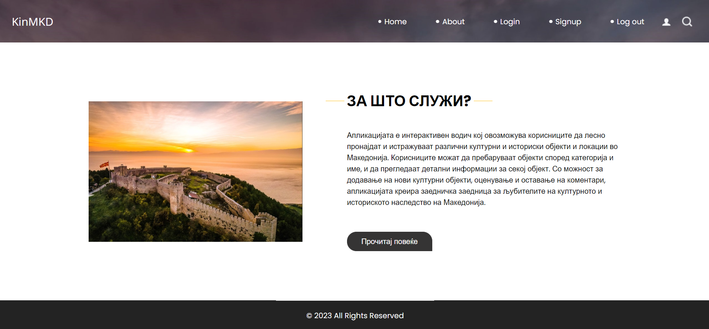
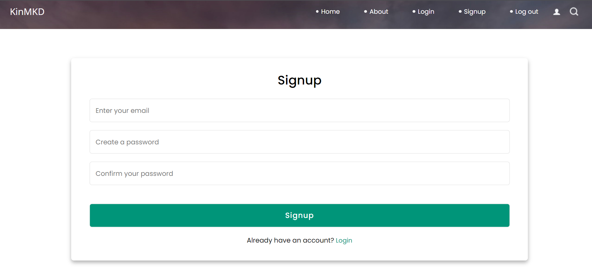
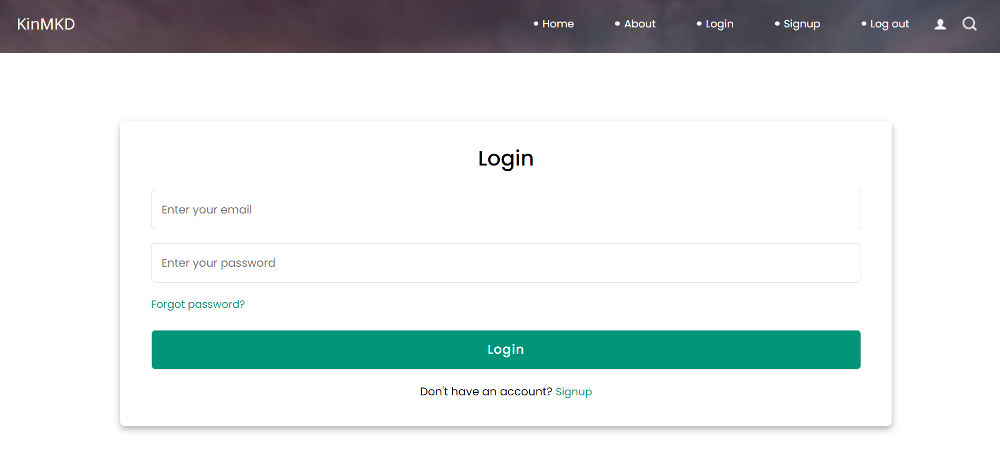
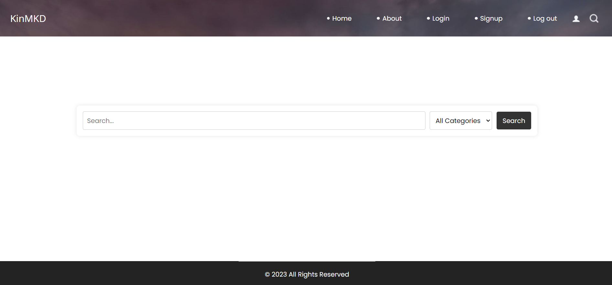
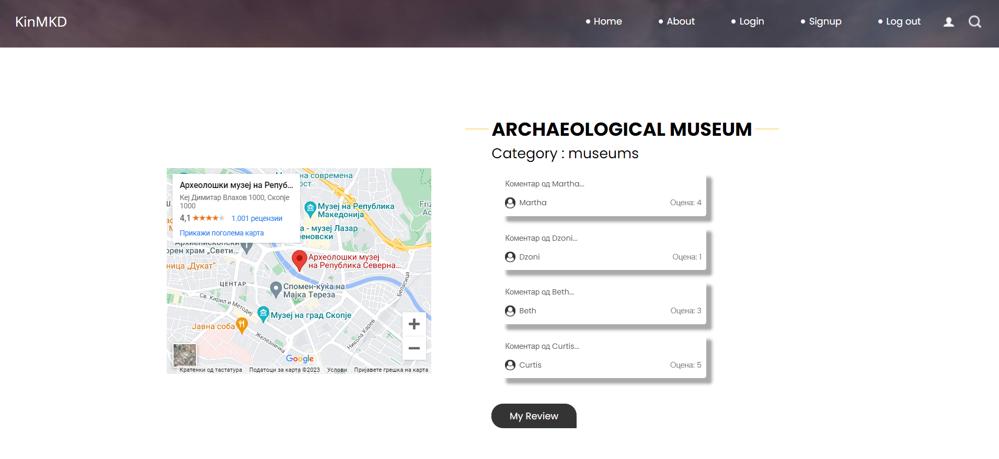
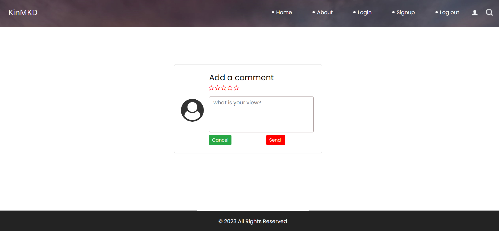
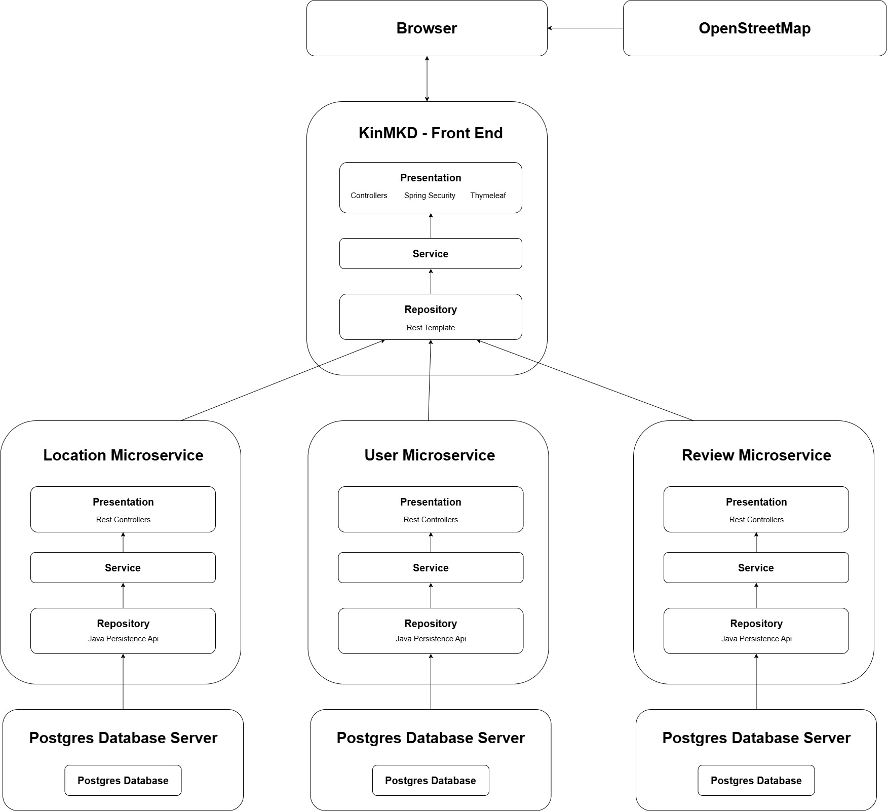

<h1>Description</h1>

KinMKD (Kulturno-istorisko nasledstvo Makedonija) is an interactive guide that allows users to easily find and explore various cultural and historical objects and locations in Macedonia. Users can search for objects by category and name and view detailed information about each object. Along with the ability to rate and leave comments, the application creates a shared community for lovers of the cultural and historical heritage of Macedonia.

OpenStreetMap, which is open-source, is used for obtaining geolocation information about various cultural objects and historical locations in Macedonia.

<h1>Functionalities</h1>

<ol>
    <li>The system should enable users to find cultural and historical objects on the territory of the state.</li>
    <li>The system should enable users to select a name and a category for search.</li>
    <li>The system should enable users to view the locations of different objects.</li>
    <li>The system should enable users to view information about cultural and historical objects.</li>
    <li>The system should enable filtering of cultural and historical objects by keyword in the name.</li>
    <li>The system should enable filtering of cultural and historical objects by category.</li>
    <li>The system should enable users to add comments about different cultural and historical objects.</li>
    <li>The system should enable users to rate the experience in cultural and historical objects with a rating from 1 to 5.</li>
    <li>The system should be connected to a database where information about the objects is stored.</li>
    <li>The system should be integrated with an API for displaying the locations of the objects on a map.</li>
    <li>The system should enable deleting user comments.</li>
    <li>The system should allow deletion of user ratings</li>
    <li>The system should prevent users from creating and deleting comments and ratings when not logged into the system.</li>
</ol>

<h1>User Interface</h1>

<h2>Home Page</h2>

<h2>About Page</h2>

<h2>Signup Page</h2>

<h2>Login Page</h2>

<h2>Search Page</h2>

<h2>Details Page</h2>

<h2>Review Page</h2>

<h1>Microservice Architecture</h1>

<h1>Run The App</h1>

<h2>Locally</h2>
<ol>
    <li>Create 3 databases in postgres: KinMKD_LocationsDb, KinMKD_ReviewsDb and KinMKD_UsersDb.</li>
    <li>Open all 4 Spring Boot projects in IntelliJ IDEA.</li>
    <li>Create a '.env' file in the root of each microservice.</li>
    <li>In each file, assign database credentials to the following environment variables: 
        <code>DB_USER=</code> 
        <code>DB_PASSWORD=</code>
    </li>
    <li>Run all 4 projects.</li>
</ol>

<h2>With Docker</h2>
<ol>
    <li>Clean and install each project with maven. 
        - If the process crashes beacause of failed tests, disable the testing phase in the maven lifecycle. 
    </li>
    <li>Run the following commands in the root of each project. 
        <code>docker build -t kinmkd-front-end .</code> 
        <code>docker build -t kinmkd-location-service .</code> 
        <code>docker build -t kinmkd-user-service .</code> 
        <code>docker build -t kinmkd-review-service .</code>
    </li>
    <li>Create a '.env' file in the root of the git repository.</li>
    <li>In the file, assign database credentials to the following environment variables: 
        <code>DB_USER=</code> 
        <code>DB_PASSWORD=</code>
    <li>Run the following command in the root of the git repository. 
        <code>docker compose up -d</code>
    </li>
</ol>

<h1>Original Repository</h1>

<a href="https://github.com/dejan-simonovski/DIANS">Link</a>